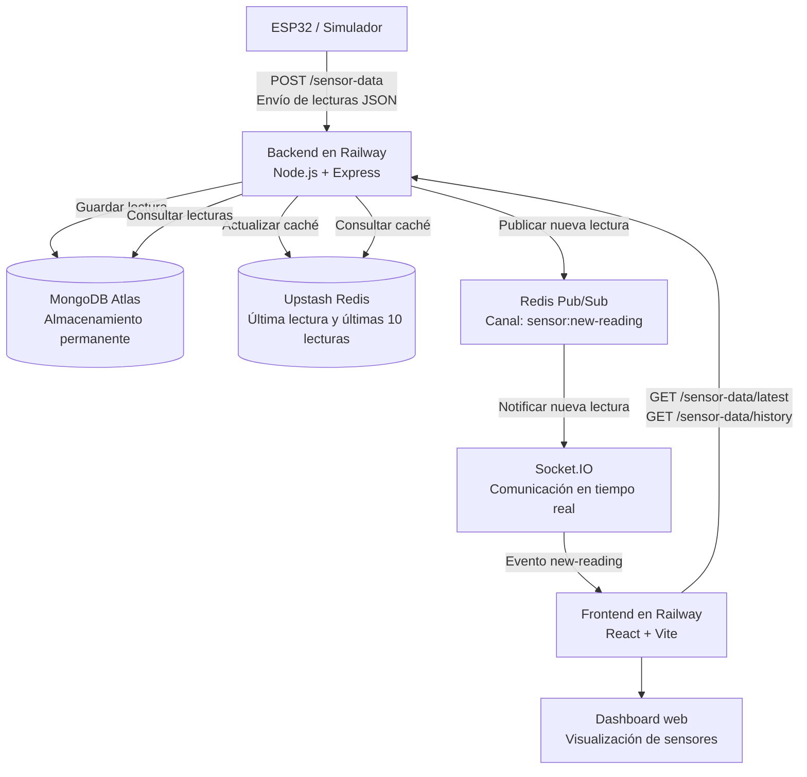

# Arquitectura del sistema – Conexión IoT

```mermaid
flowchart TD
    A["ESP32 / Simulador"] 
    B["Backend en Railway<br/>Node.js + Express"]
    C[("MongoDB Atlas<br/>Almacenamiento permanente")]
    D[("Upstash Redis<br/>Última lectura y últimas 10 lecturas")]
    E["Redis Pub/Sub<br/>Canal: sensor:new-reading"]
    F["Socket.IO<br/>Comunicación en tiempo real"]
    G["Frontend en Railway<br/>React + Vite"]
    H["Dashboard web<br/>Visualización de sensores"]

    A -->|"POST /sensor-data<br/>Envío de lecturas JSON"| B

    B -->|"Guardar lectura"| C
    B -->|"Actualizar caché"| D
    B -->|"Publicar nueva lectura"| E
    E -->|"Notificar nueva lectura"| F
    F -->|"Evento new-reading"| G
    G --> H

    G -->|"GET /sensor-data/latest<br/>GET /sensor-data/history"| B
    B -->|"Consultar lecturas"| C
    B -->|"Consultar caché"| D
```
