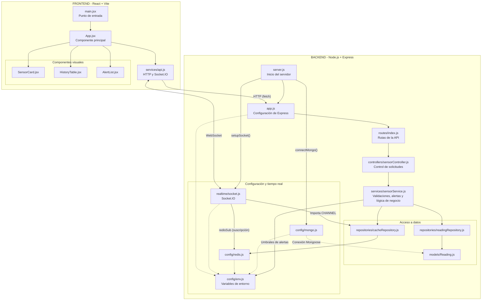

# Arquitectura del software – Conexión IoT

```mermaid
flowchart TB
    subgraph BACK["BACKEND - Node.js + Express"]
        A["server.js<br/>Inicio del servidor"]
        B["app.js<br/>Configuración de Express"]
        C["routes/index.js<br/>Rutas de la API"]
        D["controllers/sensorController.js<br/>Control de solicitudes"]
        E["services/sensorService.js<br/>Validaciones, alertas y lógica de negocio"]

        subgraph DATA["Acceso a datos"]
            F["repositories/readingRepository.js"]
            G["repositories/cacheRepository.js"]
            H["models/Reading.js"]
        end

        subgraph CONFIG["Configuración y tiempo real"]
            ENV["config/env.js<br/>Variables de entorno"]
            I["config/mongo.js"]
            J["config/redis.js"]
            K["realtime/socket.js<br/>Socket.IO"]
        end

        A --> B
        A -->|"connectMongo()"| I
        A -->|"setupSocket()"| K
        B --> C
        C --> D
        D --> E
        E --> F
        E --> G
        E -->|"Umbrales de alertas"| ENV
        F --> H
        I -.->|"Conexión Mongoose"| H
        G --> J
        K -->|"redisSub (suscripción)"| J
        K -->|"Importa CHANNEL"| G

        I -.-> ENV
        J -.-> ENV
        K -.-> ENV
        B -.-> ENV
    end

    subgraph FRONT["FRONTEND - React + Vite"]
        L["main.jsx<br/>Punto de entrada"]
        M["App.jsx<br/>Componente principal"]
        N["services/api.js<br/>HTTP y Socket.IO"]

        subgraph COMPONENTS["Componentes visuales"]
            O["SensorCard.jsx"]
            P["HistoryTable.jsx"]
            Q["AlertList.jsx"]
        end

        L --> M
        M --> N
        M --> O
        M --> P
        M --> Q
    end

    N -->|"HTTP (fetch)"| B
    N <-->|"WebSocket"| K
```